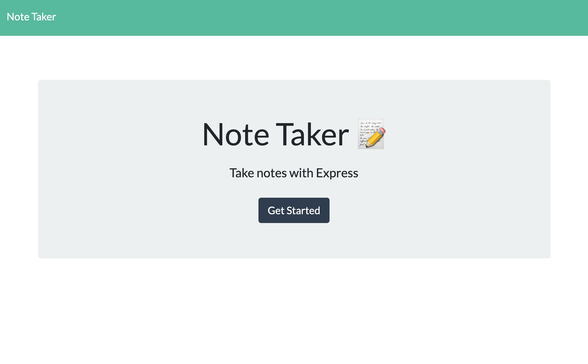

# Express-Note-Taker [](https://opensource.org/licenses/MIT)

## Description

Using the starter code that is already created with frontend code, we need to create an application that can be used to write, save, and delete notes. This application will use an express backend and save and retrieve note data from a JSON file. For users that need to keep track of a lot of information, it's easy to forget or be unable to recall something important. Being able to take persistent notes allows users to have written information available when needed. By creating the backend and connecting the two together, we can deploy an application that is user friendly.

## User Story
```
AS A user, I want to be able to write and save notes.

I WANT to be able to delete notes I've written before.

SO THAT I can organize my thoughts and keep track of tasks I need to complete.
```

## Table of Contents
* [Description](#description)
* [Installation](#installation)
* [Usage](#usage)
* [License](#license)
* [Contributing](#contributing)
* [Tests](#tests)
* [Questions](#questions)

## Installation 

* Node Package Manager: Inquirer 
* Express
* uuidv4

## Usage

* Node
* Terminal
* Javascript
* ES6
* Express

## License

* MIT

## Contributing 

N/A

## Tests

To run test, run the following commands:

```
* npm start then
* Go to localhost:3003 
```

## Criteria
```
Application should allow users to create and save notes.

Application should allow users to view previously saved notes.

Application should allow users to delete previously saved notes.
```

## Questions



* If you have any questions regarding this repository, contact me either by email at Samyaf020@gmail.com, or you can find more of my work within my github account attached here [Github](https://github.com/Samya129). Here, you can also open an issue if needed.
